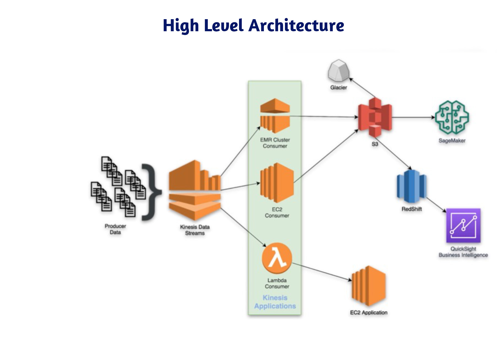
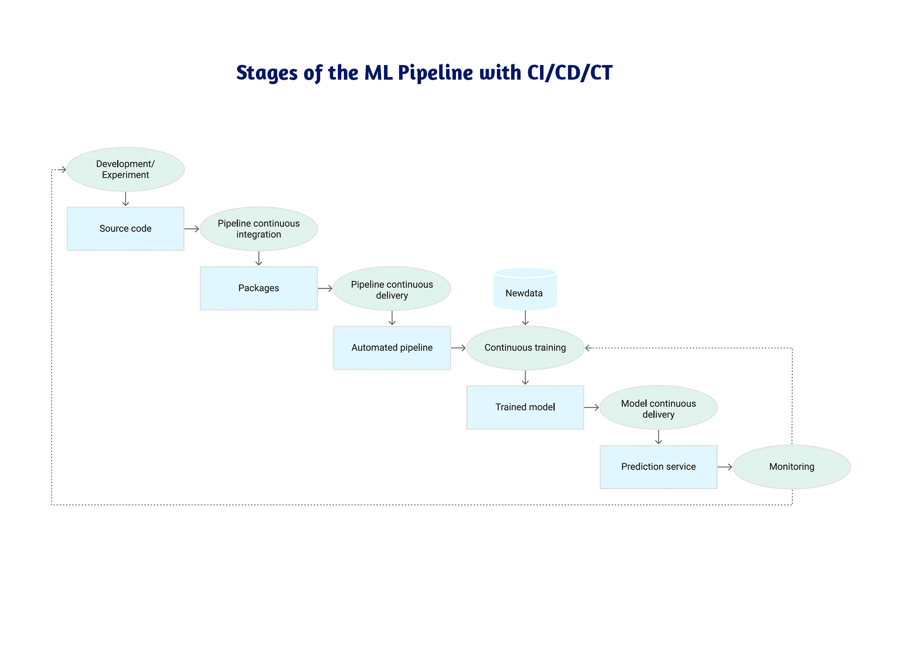

# MLOps-Genai
Architecture for Data Ingestion, Processing, and Model Deployment

# High-Level Architecture for Data Ingestion, Processing, and Model Deployment

## Overview

This repository outlines the high-level architecture for a cloud-based machine learning pipeline, leveraging various AWS services to ingest, process, train, deploy, and serve models via an API.

The diagram below provides a visual representation of the architecture.

  

## Diagram Explanation

The diagram visually represents the data flow:

- Data is ingested in real-time from producer systems into **Kinesis Data Streams**.
- Multiple consumers, including **EC2**, **Lambda**, and **EMR**, process the data.
- Processed data is stored in **S3**, which acts as the central repository.
- From **S3**, data is used for both model training in **SageMaker** and analytical queries in **Redshift**.
- Finally, the model is deployed using **AWS Fargate**, serving predictions via an API, with monitoring and retraining controlled by **CloudWatch**.

## Detailed Workflow

### 1. Data Ingestion Using AWS Kinesis Firehose

- **Kinesis Data Streams**: Streams data in real-time from the producer systems.
- **Destination**: Data is ingested and buffered, then stored in **Amazon S3** as a staging area for further processing.

### 2. ETL Processing with AWS Glue

- **AWS Glue Crawlers**: Automatically detect the schema of new data in S3 and update the data catalog.
- **AWS Glue Jobs**: Perform ETL tasks, including cleaning, transforming, and formatting the data for training or analytics. 
- **Transformation Output**: The processed data is written back to S3, either in **CSV** or **Parquet** format.

### 3. Data Storage in S3 and Redshift for Analytics

- **S3**: Processed data is stored in **Amazon S3** for machine learning training.
- **Amazon Redshift**: The data is also loaded into Redshift for analytical querying and visualization via **AWS QuickSight**.

### 4. Automated Model Training with AWS SageMaker ( it is recommended CloudFormation templates for a fully automated and reproducible infrastructure setup )

- **AWS SageMaker**: After the data is prepared and stored in S3, SageMaker is triggered to train the model. SageMaker can also handle distributed training and hyperparameter tuning if needed.
  
- **Training Jobs**: SageMaker reads training data from S3, processes it, and trains the machine learning model using the specified algorithm or custom training script.

- **Artifact Storage**: After training is complete, the trained model is stored in Amazon S3 for further use in the deployment pipeline.

### 5. Model Deployment with AWS SageMaker

- **SageMaker Hosting Services**: The trained model is deployed using SageMaker’s managed hosting services. This automatically provisions the necessary infrastructure, such as EC2 instances, load balancers, and auto-scaling, to serve your model.

- **Model Endpoint**: SageMaker creates a real-time inference endpoint to serve your model through a RESTful API. The endpoint is scalable and allows other applications to send requests for predictions.

- **Batch Inference**: For batch predictions, SageMaker also provides the **Batch Transform** feature, which processes large datasets in bulk, saving on costs for batch-based workflows.

### 6. Continuous Deployment with AWS SageMaker and AWS CodePipeline

- **AWS CodePipeline**: Automates the CI/CD process to train new versions of the model when the training data or model code is updated.

- **SageMaker Model Update**: Once the model is retrained using SageMaker, CodePipeline automates the redeployment of the updated model by creating a new SageMaker endpoint or updating the existing endpoint.

### 7. Monitoring and Retraining with AWS CloudWatch and SageMaker

- **AWS CloudWatch**: Monitors the health and performance of the SageMaker endpoint, tracking metrics such as latency, throughput, and prediction errors.

- **SageMaker Model Monitoring**: SageMaker Model Monitor continuously captures input data, outputs, and predictions to ensure that the model maintains high performance over time. If the model drifts or performance degrades, SageMaker can automatically trigger retraining jobs based on predefined thresholds.

- **Retraining Workflow**: AWS Lambda can trigger a new SageMaker training job when performance metrics fall below a certain threshold, ensuring that the model stays accurate with new data.

## Architecture Components

The following AWS services are used in this architecture:

1. **AWS Kinesis Data Streams**: For real-time data ingestion.
2. **AWS Lambda**: To trigger processing tasks and automate retraining workflows.
3. **Amazon S3**: Staging area for data storage and model artifacts.
4. **AWS Glue**: For ETL jobs to process and transform data before model training.
5. **Amazon Redshift**: Running analytics queries and storing structured data.
6. **AWS SageMaker**: For model training, deployment, and real-time/batch inference.
7. **AWS CloudWatch**: For monitoring, logging, and alerting on model performance.
8. **AWS CodePipeline**: For automating the CI/CD process, including retraining and redeployment of models when data or code changes occur.

## Additional Features

- **Data Backup**: Processed data is periodically moved to **Amazon Glacier** for long-term storage and backup.
- **API Gateway**  Can be integrated to provide additional security, authentication, and monitoring for the deployed API.

## MLOps Pipeline with CI/CD/CT Using AWS CloudFormation ( not all elements include )

The diagram below represents the stages of a Machine Learning (ML) pipeline integrated with Continuous Integration (CI), Continuous Delivery (CD), and Continuous Training (CT) practices. This pipeline is managed and automated using AWS services orchestrated via **CloudFormation** templates.

  

## Stages:

1. **Development & Experimentation**:
   - Source code is developed and stored in a version control system.
   
2. **Continuous Integration**:
   - Upon code changes, the CI process packages the ML pipeline.
   
3. **Continuous Delivery**:
   - CloudFormation provisions the infrastructure and delivers the pipeline for automated training.
   
4. **Continuous Training**:
   - New data triggers retraining of models, ensuring models are always up to date.
   
5. **Model Deployment**:
   - Trained models are continuously deployed as a prediction service using AWS Fargate or SageMaker.
   
6. **Monitoring**:
   - AWS CloudWatch monitors model performance and retriggers the pipeline when necessary, completing the CI/CD/CT loop.

This setup ensures seamless end-to-end automation for model building, training, deployment, and monitoring with minimal manual intervention.

## Getting Started

To deploy this architecture, follow these steps:

1. Set up **AWS Kinesis Data Streams** to ingest data.
2. Configure **AWS Glue** crawlers and jobs to process the data.
3. Store the processed data in **Amazon S3**.
4. Use **AWS CodeBuild** (or **SageMaker**) to train your model.
5. Deploy the trained model using **AWS Fargate**.
6. Set up **AWS CodePipeline** to automate the deployment process.
7. Monitor your deployment using **AWS CloudWatch**, and set up retraining triggers as needed.

## Prerequisites

- AWS Account with necessary permissions
- Familiarity with AWS services such as S3, Glue, Kinesis, Redshift, Fargate, and CodePipeline
- **Docker** installed for containerization
- **Python** or similar programming languages for developing the ML model and API

## License

This project is licensed under the MIT License - see the [LICENSE](LICENSE) file for details.

---

## Contact

If you have any questions or contributions, please feel free to reach out via [helloworld@example.com](mailto:helloworld@example.com).
